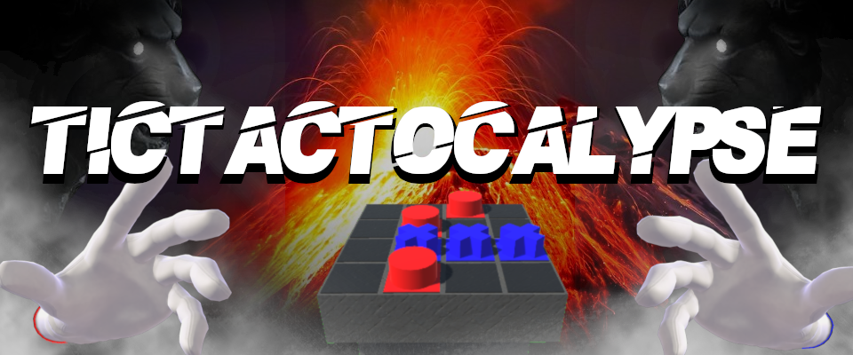

# [Tictactocalypse](https://gabrielvidal1.github.io/Projects/Tictactocalypse/)

Tictactocalypse is a funnier, realtime and apocalyptic ersion of the game TicTac-Toe. Players battle to place piece on a board, and trigger events in order to disrupt others! Play up to four players at the same time!
